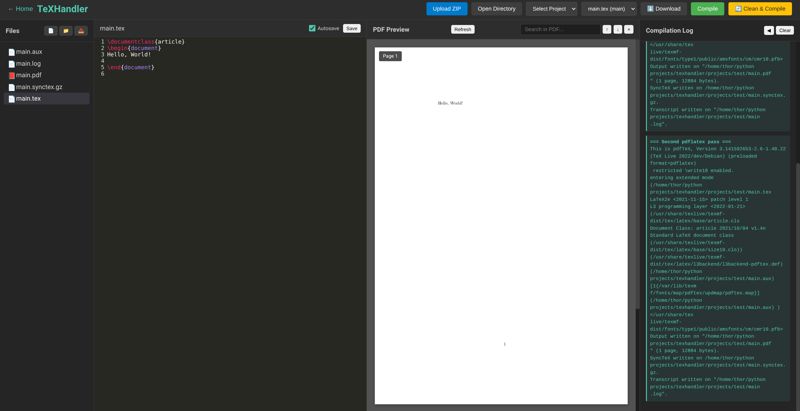

# TeXHandler - Web-Based LaTeX Editor

A modern, web-based LaTeX editor alternative to Overleaf, built with Flask and featuring real-time PDF preview, SyncTeX integration, and comprehensive project management.

## Screenshots


*Home page showing project list with create, upload, and directory options*



*Project view showing file explorer (left), LaTeX editor (center), PDF preview (right), and compilation log panel*

## Features

### 📁 Project Management
- **Create Projects**: Create new LaTeX projects with a default `main.tex` template
- **List Projects**: View all your projects with size and modification date
- **Open Projects**: Open existing projects from the home view
- **Rename Projects**: Rename projects with automatic UI refresh
- **Delete Projects**: Remove projects with confirmation
- **Download Projects**: Download entire projects as ZIP files
- **Open External Directories**: Import existing LaTeX projects from your file system

### 📝 File Management
- **File Explorer**: Tree-view file browser with directory navigation
- **File Upload**: Upload files to specific directories via button or drag-and-drop
- **File Editing**: Syntax-highlighted LaTeX editor with CodeMirror
- **File Saving**: Save files with keyboard shortcut (Ctrl+S)
- **Image Preview**: View images directly in the editor
- **File Tree Navigation**: Click files to open them in the editor

### 🔧 LaTeX Compilation
- **Compile LaTeX**: Compile LaTeX documents with full bibliography support
- **Multi-Pass Compilation**: Automatic multi-pass compilation for references
- **Bibliography Support**: Automatic detection and processing of BibTeX and Biber
- **File Selection**: Choose which `.tex` file to compile from a dropdown
- **Auto-Detection**: Automatically detect main LaTeX files
- **Clean & Compile**: Clean all auxiliary files and compile from scratch
- **Compilation Logs**: View detailed compilation logs

### 📄 PDF Viewer
- **PDF Rendering**: View compiled PDFs with PDF.js
- **Scrollable Pages**: Scroll through all pages in a continuous view
- **Text Selection**: Select and copy text from PDFs
- **Clickable Links**: Click external links to open in new tabs
- **Internal References**: Click internal references to jump to source code
- **Page Navigation**: Navigate between pages with Previous/Next buttons
- **PDF Search**: Search within PDF documents (Ctrl+F when PDF is focused)
- **PDF Highlighting**: Highlight locations in PDF when triple-clicking in editor

### 🔗 SyncTeX Integration
- **PDF to Source**: Click anywhere in PDF to jump to corresponding source code
- **Source to PDF**: Triple-click in editor to highlight corresponding PDF location
- **Sub-File Support**: Works with included `.tex` files, not just main files
- **Line Highlighting**: Automatically highlights the target line in source code
- **Location Highlighting**: Highlights PDF locations with visual indicators

### ⌨️ Editor Features
- **LaTeX Autocomplete**: Intelligent autocomplete for LaTeX commands and environments
  - Triggers automatically on `\` or manually with Ctrl+Space
  - 200+ LaTeX commands including math, environments, formatting, etc.
  - Environment name completion for `\begin{}` and `\end{}`
- **Syntax Highlighting**: Full LaTeX syntax highlighting
- **Search in Editor**: Find and replace in editor (Ctrl+F when editor is focused)
- **Focus Detection**: Automatic focus detection based on mouse clicks
- **Full-Height Editor**: Editor spans the entire vertical height of its panel
- **Line Numbers**: Line numbers for easy navigation

### 🎨 User Interface
- **Modern Dark Theme**: Clean, modern dark theme
- **Responsive Layout**: Three-panel layout (file explorer, editor, PDF viewer)
- **Project Home View**: Centralized project management interface
- **Status Messages**: Real-time status updates
- **Modal Dialogs**: User-friendly modals for project creation and file uploads

## Installation

### Prerequisites
- Python 3.7+
- LaTeX distribution (TeX Live or MiKTeX) with `pdflatex`, `bibtex`, and `biber`
- `synctex` command-line tool (usually included with LaTeX distributions)

### Setup

1. **Clone or download the repository**
   ```bash
   cd ~/python\ projects/texhandler
   ```

2. **Install dependencies**
   ```bash
   pip install -r requirements.txt
   ```

3. **Run the application**
   ```bash
   python app.py
   ```

4. **Access the application**
   - Open your browser and navigate to `http://localhost:5000`

## Usage

### Creating a Project

1. Click **"+ Create New Project"** on the home page
2. Enter a project name
3. Click **"Create"**
4. A new project with a default `main.tex` file will be created

### Uploading a Project

1. Click **"Upload ZIP"** in the header
2. Select a ZIP file containing your LaTeX project
3. The project will be extracted and available in your projects list

### Opening an External Directory

1. Click **"Open Directory"** in the header
2. Enter the full path to your LaTeX project directory
3. The directory will be copied to the projects folder

### Compiling LaTeX

1. Select a project from the dropdown
2. (Optional) Select which `.tex` file to compile from the compile file dropdown
3. Click **"Compile"** for regular compilation or **"Clean & Compile"** for a fresh build
4. The PDF will appear in the PDF viewer panel

### Editing Files

1. Click on any file in the file explorer to open it
2. Edit the file in the editor
3. Press **Ctrl+S** or click **"Save"** to save changes
4. Images will be displayed directly in the editor

### PDF Navigation

- **Click on PDF**: Jump to corresponding source code line
- **Triple-click in editor**: Highlight corresponding location in PDF
- **Scroll**: Scroll through all pages
- **Search**: Press **Ctrl+F** when PDF is focused to search
- **Links**: Click links to open external URLs or jump to references

### Using Autocomplete

- Type `\` to see all LaTeX commands
- Continue typing to filter commands (e.g., `\sec` shows `\section`, `\subsection`)
- Press **Ctrl+Space** to manually trigger autocomplete
- Use arrow keys to navigate, Enter to select

### File Operations

- **Upload to Directory**: Click the upload button (📤) in the file explorer header
- **Drag and Drop**: Drag files onto directories in the file tree
- **Download Project**: Click the download button (⬇️) to download as ZIP

## API Endpoints

### Project Management
- `GET /api/projects` - List all projects
- `POST /api/projects` - Create a new project
- `PUT /api/projects/<name>` - Rename a project
- `DELETE /api/projects/<name>` - Delete a project
- `GET /api/download/<name>` - Download project as ZIP

### File Operations
- `GET /api/files/<project>` - Get file tree
- `GET /api/file/<project>/<path>` - Get file content
- `PUT /api/file/<project>/<path>` - Save file content
- `POST /api/upload_file/<project>` - Upload file to project
- `POST /api/upload` - Upload ZIP file
- `POST /api/open_directory` - Open external directory

### Compilation
- `GET /api/compile/<project>?file=<filename>` - Compile LaTeX
- `POST /api/clean/<project>` - Clean auxiliary files
- `GET /api/tex_files/<project>` - List all .tex files

### PDF and SyncTeX
- `GET /api/pdf/<project>/<path>` - Get PDF file
- `GET /api/synctex/<project>/<path>` - Get SyncTeX file
- `POST /api/synctex/<project>/resolve` - Resolve PDF coordinates to source
- `POST /api/synctex/<project>/resolve_reverse` - Resolve source to PDF coordinates

## Keyboard Shortcuts

- **Ctrl+S**: Save current file
- **Ctrl+F**: Search (in editor or PDF, depending on focus)
- **Ctrl+Space**: Trigger autocomplete in editor
- **Tab**: Trigger autocomplete or indent
- **Escape**: Close search dialogs

## Project Structure

```
texhandler/
├── app.py                 # Flask backend application
├── templates/
│   └── index.html        # Main HTML template
├── static/
│   ├── css/
│   │   └── style.css     # Application styles
│   └── js/
│       └── app.js         # Frontend JavaScript
├── projects/              # User projects (gitignored)
├── test_app.py           # Test suite
├── requirements.txt       # Python dependencies
├── .gitignore            # Git ignore rules
└── README.md             # This file
```

## Testing

Run the test suite to verify all features:

```bash
# Run all tests
pytest test_app.py -v

# Run with coverage
pytest test_app.py -v --cov=app --cov-report=term-missing

# Run specific test
pytest test_app.py::test_create_project -v
```

The test suite includes 30 tests covering:
- Project management (create, delete, rename, list)
- File operations (read, write, upload, download)
- LaTeX compilation
- Clean functionality
- SyncTeX operations
- Security (path traversal protection)
- Error handling

## Technical Details

### Backend
- **Framework**: Flask 3.0.0
- **CORS**: Enabled for cross-origin requests
- **File Handling**: Secure file operations with path validation
- **LaTeX Compilation**: Multi-pass compilation with bibliography support
- **SyncTeX**: Integration with synctex command-line tool

### Frontend
- **Editor**: CodeMirror 5.65.2 with LaTeX mode
- **PDF Viewer**: PDF.js 3.11.174
- **Autocomplete**: Custom LaTeX command database
- **Search**: CodeMirror search for editor, custom implementation for PDF

### Compilation Process
1. First pass: Generate `.aux` file
2. Bibliography: Run `bibtex` or `biber` if needed
3. Second pass: Resolve references
4. Third pass: Finalize all references (if needed)

## Security Features

- Path traversal protection
- Input validation for project names
- Secure file path resolution
- CORS configuration
- File type validation

## Browser Compatibility

- Chrome/Edge (recommended)
- Firefox
- Safari
- Opera

## Troubleshooting

### PDF not displaying
- Ensure LaTeX compilation succeeded
- Check browser console for errors
- Verify PDF file was generated

### SyncTeX not working
- Ensure `synctex` command is in your PATH
- Check that compilation included `-synctex=1`
- Verify `.synctex.gz` file exists

### Compilation fails
- Check that `pdflatex` is installed and in PATH
- Verify LaTeX syntax is correct
- Check compilation logs in the status bar

### Autocomplete not working
- Ensure CodeMirror libraries are loaded
- Check browser console for JavaScript errors
- Try refreshing the page

## License

This project is open source and available for use and modification.

## Contributing

Contributions are welcome! Please ensure all tests pass before submitting.

## Future Enhancements

Potential features for future versions:
- Collaborative editing
- Version control integration
- Template library
- Export to various formats
- Advanced SyncTeX features
- Real-time collaboration
- Plugin system
